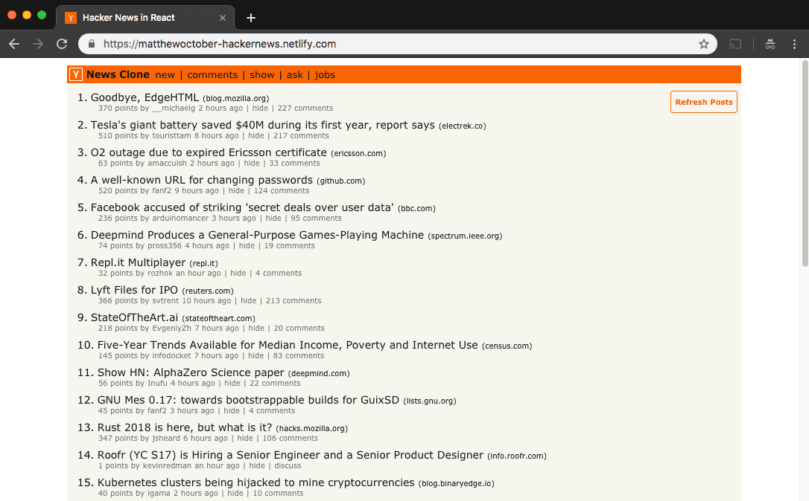

# Hacker News Clone



Using React and Hacker News' API, I decided to create my own Hacker News Clone.

Everything here is client-side JS, so brief load times should be expected when requesting posts from HN's server. However, session storage is utilized to create a more seamless experience after the initial load of each core page (links in the top nav).

To refresh all post data you can either refresh the screen or click the "Refresh Posts" button at the top of each page.

## Install

Clone this repository:

```bash
git clone https://github.com/matthewoctober/hacker-news-clone.git
```

Change into the appropriate directory:

```bash
cd hacker-news-clone
```

Install all project dependencies:

```bash
npm install
```

Run the development server:

```bash
npm run start
```
